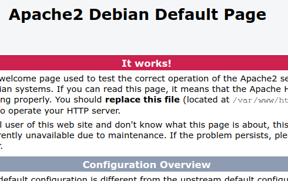

# Secure Web Server (Apache) (HTTPS)
---

#### Interactive terminal when SSH
```bash
$ export TERM=ansi
```

#### Apache2
1. Install Apache2.
```bash
$ su -
# apt install apache2
```

2. Install PHP + PHP's connector to Apache2.
```bash
# apt install php libapache2-mod-php
```

3. Make sure the apache2 services has been running.
```bash
# systemctl status apache2
...
 Loaded: loaded (/lib/systemd/system/apache2.service; enabled; vendor preset: enabled)
   Active: active (running)
...
```

4. Try to access from client's browser `http://DEBIAN_server_ip`. By default it would be showing the Debian 10 Apache web page.


#### Preparing certificate + private key for apache
1. Copy `*.crt` + `*.key`.
```bash
# cd /etc/apache2
# mkdir ssl-custom
# cd ssl-custom
# cp ~/CA-local/server_apache-crt.crt .
# cp ~/CA-local/server_apache_private-key.key .
```

#### Apache2 Configuration
1. Creating virtualhost ( `*.conf` ).
```bash
# cd /etc/apache2/sites-available
# touch tkj.com.conf
# nano/vim tkj.com.conf
<VirtualHost *:80>
	ServerName tkj.com
	ServerAlias www.tkj.com
	Redirect permanent / https://tkj.com
</VirtualHost>

<VirtualHost *:443>
    ServerAdmin admintkj@smk3.com
    ServerName tkj.com
    ServerAlias www.tkj.com
    DocumentRoot /var/www/html/tkj.com/
    ErrorLog ${APACHE_LOG_DIR}/error.log
    CustomLog ${APACHE_LOG_DIR}/access.log combined
	SSLEngine on
	SSLCertificateFile /etc/apache2/ssl-custom/server_apache-crt.crt
	SSLCertificatekeyFile /etc/apache2/ssl-custom/server_apache.key
	<Directory /var/www/html/tkj.com>
		AllowOverride All
		Options FollowSymlinks
	</Directory>
</VirtualHost>
```

> All the above configuration directives are already in 
> 1. sites-available/000-default.conf - http
> 2. sites-available/default-ssl.conf - https

2. Enable the newly created virtualhost.
```bash
# a2ensite tkj.com.conf
```

3. Enable the apache ssl module.
```bash
# a2enmod ssl
```

4. Restart apache2 services.
```bash
# systemctl restart apache2.service
```

#### Client configuration
1. Make local server on certificate folder.
```bash
# cd ~/CA-local
# python -m SimpleHTTPServer
Serving HTTP on 0.0.0.0 port 8000 ...
```

2. Download from client browser `http://DEBIAN_IP:8000`. Choose `rootCA_cert.pem`.
4. Add it to browser. Chrome : Setting > Seucirity & Privacy > Security > Manage Certificates > Authorities > Import.
5. Go to `https://tkj.com`