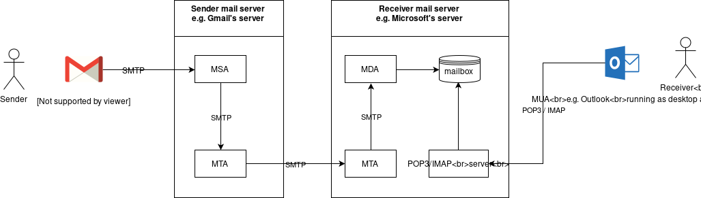
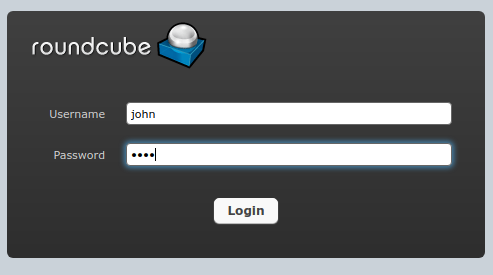

# Postfix
---

## Source
1. [afreshcloud.com](https://afreshcloud.com/sysadmin/mail-terminology-mta-mua-msa-mda-smtp-dkim-spf-dmarc)
2. [serverfault.com](https://serverfault.com/questions/982121/does-postfix-also-operate-as-mail-submission-agent-msa)
3. [microsoft.com](https://support.microsoft.com/en-us/office/what-are-imap-and-pop-ca2c5799-49f9-4079-aefe-ddca85d5b1c9)
4. [mailtrap.io](https://mailtrap.io/blog/mail-transfer-agent/)
5. [man postconf](https://linux.die.net/man/5/postconf)
6. [SMTP Error: Authentication failure: SMTP server does not support authentication](https://github.com/roundcube/roundcubemail/issues/7130)
7. [Roundcube Login failed](https://bbs.archlinux.org/viewtopic.php?id=187063)
8. [Roundcube using imaps](https://serverfault.com/questions/597280/how-configure-roundcube-to-work-with-imaps)
9. [IMAP vs POP3](https://www.geeksforgeeks.org/differences-between-pop3-and-imap/)
10. Ports:
-   `110`: POP3
-   `995`: SSL-POP (encrypted)
-   `143`: IMAP
-   `993`: IMAPS (encrypted)
-   `25`: SMTP (sometimes blocked by ISPs)
-   `587`: SMTP (The preferred non-encrypted port for outgoing connections from mail clients. Use STARTTLS for encryption.)
-   `465`: SMTP (should only be used for legacy support)



## Interactive terminal when SSH
```bash
$ export TERM=ansi
```

## Configuration FQDN
```bash
$ su -
# hostnamectl tkj.com
# nano/vim /etc/hosts
...
192.168.56.103	tkj.com
...
# reboot
```

## How email works?
- It's needs email-client called `MUA` ( Mail User Agent ). 
	- Desktop Apps: `Mozilla Thunderbird`, `Microsoft Outlook`.
	- Web Mail Apps: `Roundcube`, `SquirrelMail`.
	- Cloud SaaS Apps: `GMail`, `ProtonMail`, `Yahoo`. 
- It's needs servers called `Email Server`. 
	- This server also work as `MTA` ( Mail Transfer Agent ) that routes and delivers email.
	- Example: `Postfix`, `Microsoft Exchange`.
- It's needs `MSA` ( Mail Submission Agent ).
	- This perform email error detection before an email deliver to 	`MTA`.
	- Many `MTA` perform the function as `MSA` as well.
	- Different vendors have different needs and structure.
	- Example: `Postfix` - with special configuration.
- It's needs `MDA` ( Mail Delivery Agent ).
	- This is the last server which will store email to receiver's mailbox ( `Email Server` ).
	- Example: `Dovecot`.
- It's needs `Protocol` ( rules/regulations ).
	- `SMTP` ( Simple Mail Transfer Protocol ) as the rule of email-message, delivery, etc.
	- `IMAP/POP3` which `MUA` uses to receive email from mailbox ( `Email Server` )
		- `IMAP`: Internet Message Access Protocol.
		- `POP3`: Post Office Protocol. 
		- Both `IMAP/` & `POP3` are the most popular protocol widely used.
		- Example: `Dovecot`. Yes, this one support both as `MDA` & `IMAP/POP3`.

## What are the needs to build a local mail server?
1. `Email Server`, `MSA`, `MTA` : `Postfix`.
2. `MDA`, `IMAP` : `Dovecot`.
3. `MUA` : `Roundcube`.
4. Operating System: Debian 10 ( Buster ).
5. Local domain which already on DNS & Web Server: `mail.tkj.com`.

## Check the host file
Make sure this domain is already in `/etc/hosts`:
```bash
# nano/vim /etc/hosts
DEBIAN_IP_ADDRESS	mail.tkj.com
```

## Basic minimal postfix configuration ( port 25/smtp )
1. Install postfix
```bash
$ su -
# apt install postfix
```

2. Postmain configuration
```bash
# cd /etc/postman
# nano/vim main.cf
...
home_mailbox = Maildir/
smtpd_use_tls = no
myhostname = mail.tkj.com
mydestination = $myhostname, mail.tkj.com
...
```

3. Restart postfix service.
```bash
# systemctl restart postfix.service
```

4. Make sure postfix runs at port 25 ( `master` )
```bash
# netstat -tulpn | grep master
...            
tcp 0 0 0.0.0.0:25 0.0.0.0:* LISTEN 3523/master         
...
```

or 

```bash
# ss -tulpn | grep master
...
tcp LISTEN 0 100 0.0.0.0:25 0.0.0.0:* users:(("master",pid=3523,fd=13))
...
```

## Basic minimal dovecot configuration ( port 143/imap)
1. Install the required packages
```bash
# apt install dovecot-imapd
```

2. Edit `dovecot.conf`.
- Uncomment `listen = *, ::`
```bash
# cd /etc/dovecot
# nano/vim dovecot.conf
...
listen = *, ::
...
```

3. Activate the dovecot log file for error messages when the dovecot daemon crashes.
```bash
# cd /etc/dovecot/conf.d
# nano/vim 10-logging.conf
...
log_path = /var/log/dovecot.log
...
```

4. Set up the user-login ( imap ). Using users on debian except root-user.
```bash
# cd /etc/dovecot/conf.d
# nano/vim 10-auth.conf
...
disable_plaintext_auth = no
auth_mecanism = plain
...
```

5. Set up users' mailboxes.
```bash
# cd /etc/dovecot/conf.d
# nano/vim 10-mail.conf
...
mail_location = maildir:~/Maildir
...
```

6. Restart the service.
```bash
# systemctl restart dovecot.service 
```

## Basic minimal roundcube configuration
1. Creating subdomain at apache.
- The subdomain is `mail.tkj.com`.
- It will use `https` protocol as `https://tkj.com`.
- Reusing `tkj.com` certificate because it has SAN for subdomain `mail.tkj.com`. The location is `/etc/apache2/ssl-custom`:
	- `apache.crt`
	- `apache.key`
```bash
# cd /etc/apache2/sites-avalable
# cp tkj.com.conf mail.tkj.com.conf
# nano/vim mail.tkj.com.conf
<VirtualHost *:80>
	ServerName mail.tkj.com
	ServerAlias mail.tkj.com
	Redirect permanent / https://mail.tkj.com
</VirtualHost>

<VirtualHost *:443>
    ServerAdmin admin@tkj.com
    ServerName mail.tkj.com
    ServerAlias mail.tkj.com
    DocumentRoot /var/www/html/roundcubemail/
    ErrorLog ${APACHE_LOG_DIR}/error.log
    CustomLog ${APACHE_LOG_DIR}/access.log combined
	SSLEngine on
	SSLCertificateFile /etc/apache2/ssl-custom/apache.crt
	SSLCertificatekeyFile /etc/apache2/ssl-custom/apache.key
	<Directory /var/www/html/roundcubemail>
		AllowOverride All
		Options FollowSymlinks
	</Directory>
</VirtualHost>
# a2ensite mail.tkj.com.conf
# systemctl restart apache2.service
```

2. Install Database
```bash
$ su -
# apt install mariadb-server
# which mysql
/usr/bin/mysql
```

3. Install roundcube
```bash
# apt install roundcube
Configure database for roundcube with dbconfig-common? Yes
MySQL application password for roundcube: *****
Password confirmation: *****
```

- `MySQL application password for roundcube`: Input the root password for mysql. The `apt install roundcube` needs access to database, creating roundcube-db ( check on step 4 below ).
- This installation will be in `/usr/share/roundcube/`.
- The configuration files will be in `/etc/roundcube/`. In this place we will connect roundcube to `dovecot` ( grap email ) & `postfix` (  send email ).

4. Check db of roundcube
```bash
$ su -
# mysql
# show databases;
MariaDB [(none)]> show databases;
+--------------------+
| Database           |
+--------------------+
| information_schema |
| mysql              |
| performance_schema |
| roundcube          |
+--------------------+
4 rows in set (0.000 sec)
MariaDB [mysql]> use roundcube;
MariaDB [roundcube]> show tables;
+---------------------+
| Tables_in_roundcube |
+---------------------+
| cache               |
| cache_index         |
| cache_messages      |
| cache_shared        |
| cache_thread        |
| contactgroupmembers |
| contactgroups       |
| contacts            |
| dictionary          |
| identities          |
| searches            |
| session             |
| system              |
| users               |
+---------------------+
14 rows in set (0.001 sec)
```

5. Configure roundcube.
```bash
# cd /etc/roundcube
# nano/vim config.inc.php
...
$config['default_host'] = 'mail.tkj.com';
$config['smtp_server'] = 'localhost';
$config['smtp_port'] = 25;
$config['smtp_user'] = '';
$config['smtp_pass'] = ''; 
...
```

## Add 2 user on debian for testing
```bash
# adduser john
# adduser boy
```

## Test on client
1. Open 2 browser `https://mail.tkj.com`.
	- Usrname browser 1: `john`.
	  
	- Usrname browser 2: `boy`.
2. Test for send email between users.